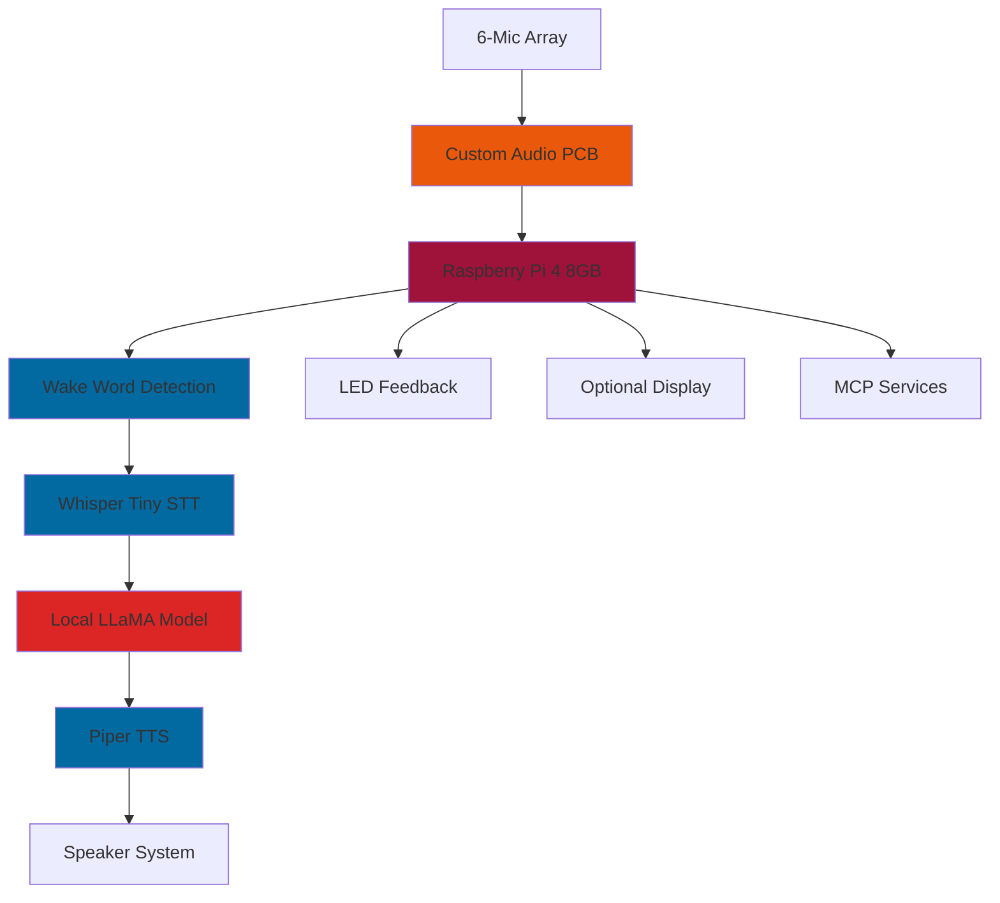

<h1 align="center">ATHENA</h1>
<h3 align="center">Open-Source AI Smart Home Assistant Speaker</h3>

<p align="center">
  
</p>

<p align="center">

    
    
</p>

## 🎯 Project Overview

**ATHENA** (Autonomous Transformer-Based Heuristic Extending Natural-Language Assistant) is an advanced DIY smart speaker that aims to outperform commercial alternatives like Amazon Echo and Google Home by prioritizing privacy, intelligence, and customization.

Built around a Raspberry Pi 4 with custom-designed hardware, ATHENA aims to combine local AI processing, premium audio components, and an open-source philosophy to create a truly intelligent voice assistant that keeps your data private and your experience personalized.

## Why This Project Matters

### **The Problem with Current Smart Speakers**

> "Honestly, I have an Echo Dot at home and it sucks for anything but asking the time or very basic commands. With AI being so good now, it only makes sense to have something that's ACTUALLY intelligent."

Current commercial smart speakers are limited by:
- **Privacy Concerns** - All voice data sent to cloud servers
- **Limited Intelligence** - Basic command-response patterns
- **Lack of Customization** - Closed ecosystems
- **Vendor Lock-in** - Tied to specific services

### **ATHENA's Solution:**

<table>
<tr>
<td align="center" width="25%">
<br><strong>Complete Privacy</strong><br>
<em>Everything runs locally</em>
</td>
<td align="center" width="25%">
<br><strong>True Intelligence</strong><br>
<em>Modern AI with context understanding</em>
</td>
<td align="center" width="25%">
<br><strong>Full Customization</strong><br>
<em>Open source & modular design</em>
</td>
<td align="center" width="25%">
<br><strong>Service Freedom</strong><br>
<em>Connect to any service via MCP</em>
</td>
</tr>
</table>

<div align="center">
<strong>✨ The Open Source, customisable smart speaker that actually respects you ✨</strong>
</div>

## Key Features

<table>
<tr>
<td width="50%">

### 🛡️ **Privacy First**
- **Local AI Processing** - Your voice never leaves your device
- **No Cloud Dependencies** - Fully offline operation
- **Open Source** - Complete transparency in data handling
- **Custom Wake Words** - Personalized trigger phrases

</td>
<td width="50%">

### 🧠 **AI Pipeline (planned)**
- **Whisper Tiny** - Advanced speech recognition
- **Local LLaMA Models** - Intelligent conversation
- **Piper TTS** - Natural voice synthesis
- **MCP Integration** - Connect to various services

</td>
</tr>
<tr>
<td width="50%">

### 🎵 **Premium Audio**
- **6-Microphone Array** - Voice pickup from across the room
- **Noise Cancellation** - Crystal clear input processing
- **High-Quality Speakers** - Mid-range + tweeter configuration
- **Custom Audio PCB** - Professional amplification

</td>
<td width="50%">

### 🔧 **Modular Design**
- **Custom PCB Design** - Audio and power management
- **3D Printed Case** - Proper acoustic properties
- **LED Feedback System** - Visual user interaction
- **Optional Display** - Visual feedback panel
- **Future Upgrades** - Expandable architecture

</td>
</tr>
</table>

### 🎯 Project Roadmap

- [ ] **Phase 1**: Hardware design and component selection
- [ ] **Phase 2**: Basic software framework
- [ ] **Phase 3**: Custom PCB design and manufacturing
- [ ] **Phase 4**: 3D printed case design
- [ ] **Phase 5**: Wake word detection implementation
- [ ] **Phase 6**: Local AI model integration
- [ ] **Phase 7**: Audio processing pipeline
- [ ] **Phase 8**: LED feedback system
- [ ] **Phase 9**: MCP service integration
- [ ] **Phase 10**: Final testing and optimization

## 🏗️ (Planned) System Architecture



## 💰 Estimated Bill of Materials & Cost Breakdown

<div align="center">

| Component | Description | Cost |
|-----------|-------------|------|
| 🍓 **Raspberry Pi 4 8GB** | Main processing unit | **$55** |
| 🎤 **6-Microphone Array** | High-quality voice pickup | **$35** |
| 🔌 **Custom PCB** | Audio & power management | **$25** |
| 🔊 **Speaker Components** | Mid-range + tweeter system | **$45** |
| 🏠 **Custom Case** | 3D printed + laser cut acrylic | **$30** |
| 📺 **Display Panel** | Optional visual feedback | **$35** |
| ⚡ **Power Components** | Supply & management | **$20** |
| 🔘 **Controls & LEDs** | Buttons, LEDs, interconnects | **$15** |
| 🔧 **Miscellaneous** | Hardware & assembly | **$15** |
| | **TOTAL** | **~$275** |

</div>

## 🧬 Technology Stack

<div align="center">

### **Audio Processing Pipeline**
```
Voice Input → Noise Cancellation → Wake Word → Whisper STT → LLaMA → Piper TTS → Audio Output
```

</div>
- **Piper TTS** - Natural voice synthesis
- **Custom Voice Models** - Personalized assistant
- **LED Feedback** - Visual status indicators
- **Display Integration** - Optional visual output

</td>
</tr>
</table>

### 🔧 **Development Stack**
- **Hardware**: Raspberry Pi 4, Custom PCB Design
- **Audio**: ALSA, PyAudio, Advanced noise processing
- **AI Models**: Whisper, LLaMA, Piper TTS
- **Framework**: Python, Flask web interface
- **Integration**: MCP (Model Context Protocol)
- **Services**: Spotify control, IoT integration

## 🚀 Getting Started

### 📋 Prerequisites

<table>
<tr>
<td width="50%">

**Hardware Requirements:**
- Raspberry Pi 4 (8GB recommended)
- MicroSD Card (64GB+)
- 3D Printer access
- Basic soldering skills
- Multimeter for testing

</td>
<td width="50%">

**Software Requirements:**
- Python 3.8+
- Raspberry Pi OS
- Git
- Audio libraries (ALSA)
- AI model dependencies

</td>
</tr>
</table>

### 📥 Quick Installation

```bash
# Clone the repository
git clone https://github.com/kuberwastaken/ATHENA.git
cd ATHENA

# Install dependencies
pip install -r requirements.txt

# Run initial setup
python setup.py install

# Start ATHENA
python main.py
```


## 🔗 References & Inspiration

<table>
<tr>
<td width="50%">

### **Hardware Inspiration**
- [Mycroft Mark II](https://mycroft.ai/) - Open source voice assistant
- [Seeed Studio ReSpeaker](https://www.seeedstudio.com/ReSpeaker-4-Mic-Array-for-Raspberry-Pi.html) - Microphone array design
- [ReSpeaker Implementation](https://github.com/respeaker) - Community implementations
- [Home Assistant Atom](https://www.home-assistant.io/) - Smart home integration

</td>
<td width="50%">

### **Technical Resources**
- [NetworkChuck Video](https://www.youtube.com/watch?v=your-video) - Initial inspiration
- [Asian Mom Project](https://asianmom.kuber.studio/) - Similar AI pipeline demo I made
- OpenAI Whisper documentation
- Meta LLaMA model resources
- Piper TTS implementation guides

</td>
</tr>
</table>

## 🤝 Contributing


**This is an open-source project and contributions are welcome!**

Please see the [Contributing Guidelines](docs/CONTRIBUTING.md) for detailed information.

## 📈 Development Progress

Follow the detailed development journey in our [**Development Journal**](JOURNAL.md), updated regularly with:

- 📊 **Progress Updates** - What's been accomplished
- 🔧 **Technical Challenges** - Problems solved and lessons learned  
- 🎯 **Milestones** - Major achievements and next steps
- 📸 **Build Photos** - Visual progress documentation
- 💡 **Design Decisions** - Why certain choices were made

## 📜 License

This project is licensed under the **MIT License** - see the [LICENSE](LICENSE) file for details.

---

<div align="center">

### 🌟 **Star this repository if you find it interesting!**

**Built with ❤️ by [Kuber Mehta](https://x.com/Kuberwastaken)**

*Making AI assistants truly intelligent, private, and customizable*

[](https://github.com/kuberwastaken/ATHENA/stargazers)
[](https://github.com/kuberwastaken/ATHENA/network)
[](https://github.com/kuberwastaken/ATHENA/watchers)

</div>
